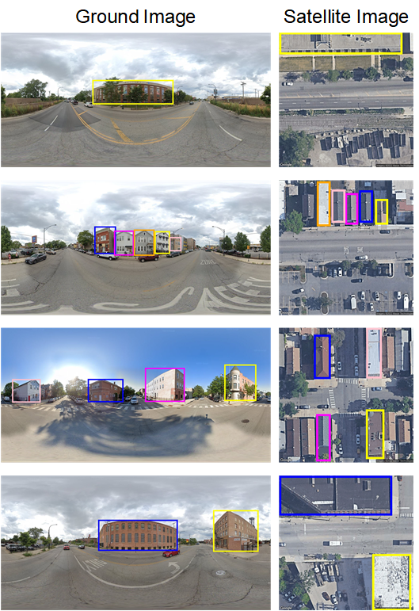

# VIGOR-Building Dataset

<div align="center">
  
</div>

## Introduction
The VIGOR-Building dataset aims to evaluate the cross-view object geo-localization task in a more realistic setting, bridging the gap between many-to-many object localization and existing datasets. VIGOR-Building is built upon the VIGOR-GAN dataset and aims to provide a more comprehensive and realistic resource to support research and development in the field of cross-view object geo-localization.

## Data Collection
The VIGOR-Building dataset includes images from three major cities: Chicago, New York, and San Francisco. We have randomly selected images from these cities to ensure diversity and comprehensive coverage.

## Data Annotation
To facilitate object localization, we annotated the ground images using YOLOv9 and the satellite images using OpenStreetMap. Additionally, manual annotations were performed to refine the dataset.

## Download
The download link is [VIGOR-Building](https://drive.google.com/file/d/1KxyficZFY20IxMP_rI0WK2ZE15_GSLrJ/view?usp=sharing ).

## Citation
```bibtex
@article{yang2024retrieval,
  title={Retrieval-guided Cross-view Image Synthesis},
  author={Yang, Hongji and Li, Yiru and Zhu, Yingying},
  journal={arXiv preprint arXiv:2411.19510},
  year={2024}
}
